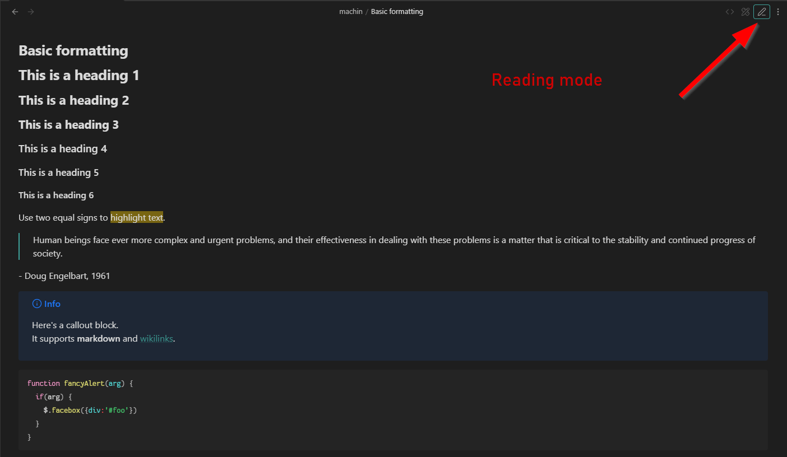

# File Header Shortcuts: Edit Modes

Add a button in file header in edit mode, to switch between source & live-preview.

Doesn't work if LP or file header is disabled

In the setting, it is possible to create a "three mode toggle", with order. The button will, then, allow to switch between read/source/LP. It will disable the default Obsidian button, obviously.

> [!note]
> It is possible that LP will "blink" when switched with this mode.

You can also enable the "three mode" button, that add in the file header the three buttons and the button of the active mode will get a border, like this:

## Styling

The plugin will use the following css class:
- `.edit-mode-button`: Button added in the file header
- `.edit-mode-hide`: Settings to hide the reading button
- `.edit-mode-default-button`: Reading button in the three mode behavior

The button in the three mode button will get the `is-active` class when necessary.

## 📥 Installation

- [x] From Obsidian's community plugins
- [x] Using BRAT with `https://github.com/Mara-Li/obsidian-shortcuts-LP_Source`
- [x] From the release page: 
    - Download the latest release
    - Unzip `shortcuts-edit-mode.zip` in `.obsidian/plugins/` path
    - In Obsidian settings, reload the plugin
    - Enable the plugin
